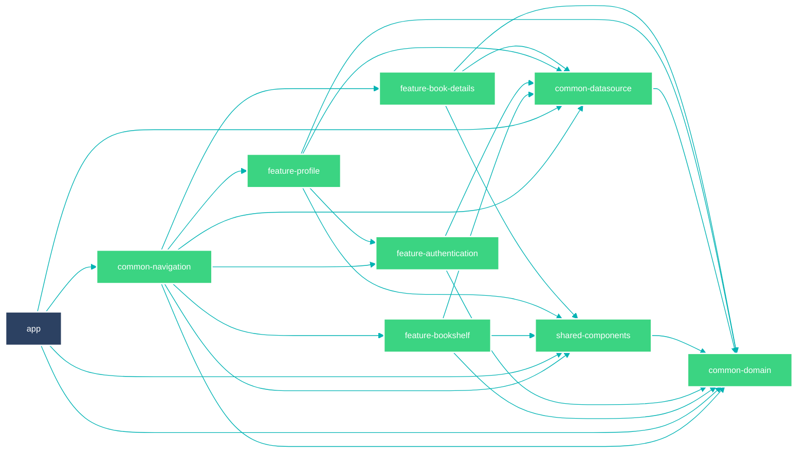

# Preface

  
  
  
  
  

Preface is a bookshelf app built by a lazy reader (myself) as an accountability tool and bookmark for his reading progress.

### 🖲️ Key features
- Online/Offline persisted bookshelves
- Reading progress
- Book search powered by Google books api (If it is published, you will find it)

### 📱 Screenshots

  
  
  
  
  

### 💻 Contributions
Appreciate the project? Here's how you can help:

- 🌟 Star : Give it a star at the top right. It means a lot!
- 😎 Contribute : Found an issue or have a feature idea? Submit a PR.
- 💬 Feedback : Have suggestions? Open an issue or start a discussion.

### Module Graph

